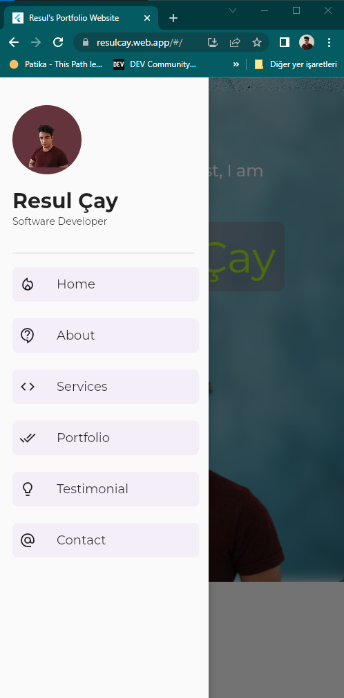
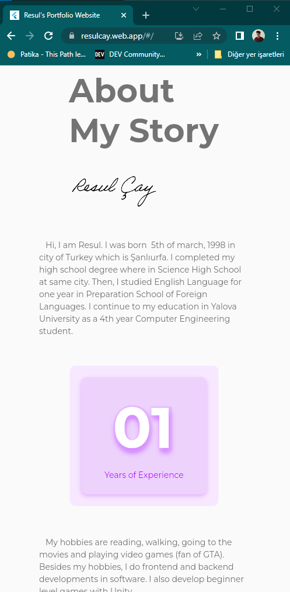

# portfolio_web

website link : https://resulcay.web.app/

---Desktop Size View ScreenShots---

  |    |
  |    |

---Tablet Size View  ScreenShots---

  |    |
  |    |

---Mobile Size View  ScreenShots---

  |    |
  |    |

Inspired on: https://www.youtube.com/watch?v=Y4oJMiEwlBg

## Getting Started

This project is a starting point for a Flutter application.

A few resources to get you started if this is your first Flutter project:

- [Lab: Write your first Flutter app](https://docs.flutter.dev/get-started/codelab)
- [Cookbook: Useful Flutter samples](https://docs.flutter.dev/cookbook)

For help getting started with Flutter development, view the
[online documentation](https://docs.flutter.dev/), which offers tutorials,
samples, guidance on mobile development, and a full API reference.
